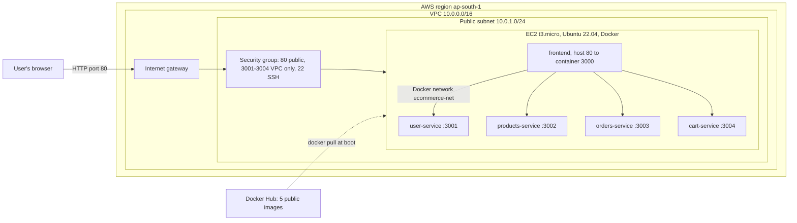

# Multi-Service Node.js E-commerce App on AWS with Terraform and Docker

This project deploys a small Node.js e-commerce application made of **five Docker containers**
(one frontend and four backend microservices) onto an **AWS EC2** instance. All AWS
infrastructure is created with **Terraform**, and the EC2 instance installs Docker and starts
every container automatically through a **user-data script**. One `terraform apply` builds the
whole environment and prints the public URL of the frontend.

## Architecture



The frontend homepage shows **"Frontend is Live"** and, on every page load, calls each backend
over the private Docker network (`ecommerce-net`) and shows whether it is running. This proves
both public access and internal service-to-service communication.

## Services

| Service | Container port | Host port on EC2 | Endpoints | Sample response |
|---|---|---|---|---|
| frontend | 3000 | 80 (public) | `/`, `/health`, `/api/users`, `/api/products`, `/api/orders`, `/api/cart` | "Frontend is Live" page with backend status |
| user-service | 3001 | 3001 (VPC only) | `/`, `/health`, `/users` | `{"message":"User Service Running"}` |
| products-service | 3002 | 3002 (VPC only) | `/`, `/health`, `/products` | `{"message":"Products Service Running"}` |
| orders-service | 3003 | 3003 (VPC only) | `/`, `/health`, `/orders` | `{"message":"Orders Service Running"}` |
| cart-service | 3004 | 3004 (VPC only) | `/`, `/health`, `/cart` | `{"message":"Cart Service Running"}` |

Each service is a plain Node.js 22 app with no external npm packages, built on the
`node:22-alpine` image. Every service logs `<Name> Running on port <port>` at startup and logs
each request, so `docker logs <name>` shows it is alive.

## Repository structure

```
.
├── frontend/                 # Frontend service (Dockerfile, server.js, package.json)
├── user-service/             # Backend: users
├── products-service/         # Backend: products
├── orders-service/           # Backend: orders
├── cart-service/             # Backend: cart
├── build-and-push.sh         # Helper: build all 5 images and push to Docker Hub
├── terraform/
│   ├── provider.tf           # Terraform + AWS provider settings
│   ├── variables.tf          # Input variables (region, instance type, Docker Hub user...)
│   ├── terraform.tfvars      # My values for those variables
│   ├── network.tf            # VPC, public subnet, internet gateway, route table
│   ├── security_group.tf     # Firewall rules
│   ├── ec2.tf                # Ubuntu AMI lookup, key pair, EC2 instance
│   ├── user_data.sh.tpl      # Boot script: install Docker, pull images, run containers
│   └── outputs.tf            # Prints public IP, DNS and URLs
└── screenshots/              # Evidence of each step
```

## Infrastructure created by Terraform

| Resource | Purpose |
|---|---|
| `aws_vpc.main` | Dedicated VPC `10.0.0.0/16` with DNS hostnames enabled |
| `aws_internet_gateway.igw` | Gives the VPC internet access |
| `aws_subnet.public` | Public subnet `10.0.1.0/24`; instances get a public IP automatically |
| `aws_route_table.public` + association | Routes `0.0.0.0/0` to the internet gateway, making the subnet public |
| `aws_security_group.app` | Port 80 open to the internet (frontend), ports 3001-3004 open only inside the VPC (internal service traffic), port 22 for SSH, all outbound allowed |
| `aws_key_pair.app` | Uploads my public SSH key so I can log in to the instance |
| `aws_instance.app` | Ubuntu 22.04 `t3.micro` in the public subnet, with the user-data script |

A custom VPC is used instead of the account's default VPC so the whole network is defined in
code and can be recreated identically in any AWS account with `terraform apply`.

## How the deployment works

1. **Build (manual, on my laptop):** each service has its own Dockerfile. Images are built for
   `linux/amd64`, tested locally, tagged `v1`, and pushed to Docker Hub as public repositories
   `<dockerhub-user>/<service>:v1`.
2. **Provision (Terraform):** `terraform apply` creates the network, security group, key pair and
   EC2 instance, passing `user_data.sh.tpl` (filled in with the Docker Hub username and tag
   through `templatefile()`) as the instance's user data.
3. **Configure (user-data, runs once at first boot as root):** installs `docker.io`, pulls all five
   images, creates the `ecommerce-net` Docker network, and runs the five containers with
   `--restart unless-stopped`. The frontend is published on port 80. Output is logged to
   `/var/log/user-data.log`.
4. **Output:** Terraform prints `public_ip`, `public_dns`, `frontend_url` and an `ssh_command`.

## Prerequisites

AWS account and an IAM user with access keys, AWS CLI v2 (`aws configure` done), Terraform 1.3 or
newer, Docker Desktop, a Docker Hub account, and Git.

## How to reproduce

```bash
# 1. Build, test and push the images (replace <user> with your Docker Hub username)
docker login
./build-and-push.sh <user> v1

# 2. Create an SSH key inside the terraform folder (press Enter at the passphrase prompts)
cd terraform
ssh-keygen -t rsa -b 4096 -f ecommerce-key

# 3. Put your Docker Hub username in terraform.tfvars, then:
terraform init
terraform validate
terraform plan
terraform apply

# 4. Wait 2-4 minutes for the boot script, then open the frontend_url output in a browser
terraform output frontend_url

# 5. Clean up when finished
terraform destroy
```

## Verification

| Check | How | Expected result |
|---|---|---|
| Frontend is public | Open `http://<public_ip>` | "Frontend is Live" and "4 of 4 backend services running" |
| Backend data | Open `http://<public_ip>/api/products` | JSON list of products |
| Containers running | `ssh -i ecommerce-key ubuntu@<public_ip>` then `sudo docker ps` | 5 containers with status "Up" |
| Backend responses | `curl localhost:3001` ... `curl localhost:3004` on the instance | `"User Service Running"` etc. |
| Backend logs | `sudo docker logs user-service` | `User Service Running on port 3001` |
| Boot script | `sudo tail -n 30 /var/log/user-data.log` | Ends with `User-data script finished` |

## Screenshots

1. `screenshots/01-docker-images-local.png` - `docker images` showing the 5 images
2. `screenshots/02-local-test.png` - frontend running locally at `http://localhost:8080`
3. `screenshots/03-dockerhub-repos.png` - the 5 public repositories on Docker Hub
4. `screenshots/04-terraform-apply.png` - `Apply complete!` with the outputs
5. `screenshots/05-aws-vpc-subnet.png` - VPC and subnet in the AWS console
6. `screenshots/06-aws-security-group.png` - security group inbound rules
7. `screenshots/07-aws-ec2-running.png` - EC2 instance in the running state
8. `screenshots/08-frontend-live.png` - frontend opened on the public IP
9. `screenshots/09-api-response.png` - `/api/products` response
10. `screenshots/10-docker-ps-ec2.png` - `sudo docker ps` on the EC2 instance
11. `screenshots/11-docker-logs.png` - backend container logs and `curl` responses
12. `screenshots/12-terraform-destroy.png` - `Destroy complete!`

## Troubleshooting

| Problem | Cause and fix |
|---|---|
| Browser shows "connection refused" right after apply | The boot script is still running. Wait 2-4 minutes and refresh. |
| `exec format error` in `docker logs` | Image built on an ARM machine (Apple Silicon) without `--platform linux/amd64`. Rebuild with that flag and push again. |
| `pull access denied` in `/var/log/user-data.log` | Wrong Docker Hub username or tag in `terraform.tfvars`, or the repositories are private. |
| A service shows "Down" on the homepage | `sudo docker ps -a` and `sudo docker logs <service>` on the instance. |
| `InvalidKeyPair.Duplicate` during apply | A key pair named `ecommerce-key` already exists in the region; delete it in the EC2 console or change `project_name`. |

## Security notes

Backend ports 3001-3004 are reachable only from inside the VPC; the public can reach only the
frontend on port 80. SSH is open to `0.0.0.0/0` by default for convenience and should be
restricted with `ssh_allowed_cidr = "<your-ip>/32"`. The SSH private key and Terraform state
files are excluded from Git through `.gitignore`.
