# Multi-Service Node.js E-commerce Deployment on AWS (Terraform + Docker)

Deployment of a Node.js e-commerce application made of four backend services (**User**, **Products**, **Orders** and **Cart**) and one **Frontend**. Each service is containerised with Docker and published on Docker Hub. Terraform provisions the AWS infrastructure (VPC, public subnet, internet gateway, route table, security group and an EC2 instance), and an EC2 user-data script installs Docker, pulls all five images and runs them. The frontend is publicly reachable and Terraform prints its public IP and DNS name.

---

## 1. Architecture

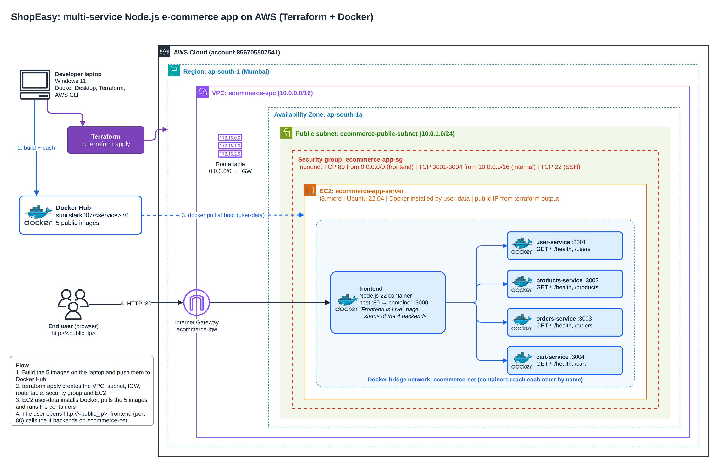

The diagram was drawn in draw.io. The editable source is [`docs/architecture.drawio`](docs/architecture.drawio); open it at app.diagrams.net.

| Service | Docker image | Container port | Host port on EC2 | Endpoints |
| --- | --- | --- | --- | --- |
| `frontend` | `sunilstark007/frontend:v1` | 3000 | 80 (public) | `/`, `/health`, `/api/{users,products,orders,cart}` |
| `user-service` | `sunilstark007/user-service:v1` | 3001 | 3001 (VPC only) | `/`, `/health`, `/users` |
| `products-service` | `sunilstark007/products-service:v1` | 3002 | 3002 (VPC only) | `/`, `/health`, `/products` |
| `orders-service` | `sunilstark007/orders-service:v1` | 3003 | 3003 (VPC only) | `/`, `/health`, `/orders` |
| `cart-service` | `sunilstark007/cart-service:v1` | 3004 | 3004 (VPC only) | `/`, `/health`, `/cart` |

| AWS resource (Terraform) | Name | Configuration |
| --- | --- | --- |
| `aws_vpc.main` | ecommerce-vpc | `10.0.0.0/16`, DNS hostnames enabled |
| `aws_internet_gateway.igw` | ecommerce-igw | Internet access for the VPC |
| `aws_subnet.public` | ecommerce-public-subnet | `10.0.1.0/24` in `ap-south-1a`, public IP on launch |
| `aws_route_table.public` + association | ecommerce-public-rt | `0.0.0.0/0` → internet gateway |
| `aws_security_group.app` | ecommerce-app-sg | In: `80` from anywhere, `3001-3004` from `10.0.0.0/16`, `22` for SSH |
| `aws_key_pair.app` | ecommerce-key | SSH key for verification |
| `aws_instance.app` | ecommerce-app-server | `t3.micro`, Ubuntu 22.04, 10 GB gp3, user-data |

### Design decisions

- **Containers find each other by name.** All five containers join the user-defined Docker network `ecommerce-net`, so the frontend reaches the backends at `http://user-service:3001`, `http://products-service:3002` and so on. These URLs are passed to the frontend as environment variables, so nothing is hard-coded to an IP address.
- **Only the frontend is public.** The frontend is published on host port **80**, the only port open to the internet for the app. The backend ports `3001-3004` are open in the security group only to the VPC CIDR `10.0.0.0/16`, as the assignment's "internal communication" rule requires.
- **A dedicated VPC, not the default one.** The assignment asks Terraform to provision a VPC with a public subnet, so the network is created from code. `terraform apply` recreates it identically in any account; the account's default VPC (`172.31.0.0/16`) is left untouched.
- **User-data instead of provisioners.** The boot script runs once as root when the instance starts, so Terraform never needs an SSH connection. It retries `apt` (Ubuntu can hold the apt lock during its first-boot updates) and `docker pull`, and logs everything to `/var/log/user-data.log`.
- **The AMI is looked up, not hard-coded.** A data source finds the latest Canonical Ubuntu 22.04 image, so the same code works in any region.
- **`--platform linux/amd64` on every build.** This guarantees the images match the x86_64 EC2 instance, whatever machine they are built on.
- **`--restart unless-stopped`** brings the containers back automatically if the instance reboots.

---

## 2. Prerequisites

| Tool | Version used | Check |
| --- | --- | --- |
| Docker Desktop | 28.5.1 | `docker --version` |
| AWS CLI | 2.35.7 | `aws --version` |
| Terraform | 1.16.2 | `terraform -version` |

Docker Desktop must be **running** (bottom-left shows *Engine running*) before any `docker` command. `docker run hello-world` confirms the engine responds, not just the CLI.

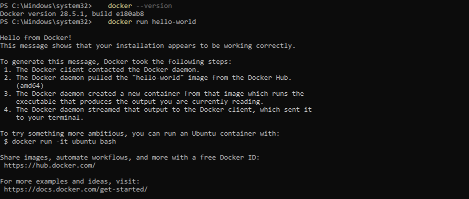

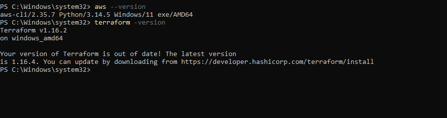

AWS access uses IAM Identity Center (SSO):

```powershell
aws sso login
aws sts get-caller-identity
```

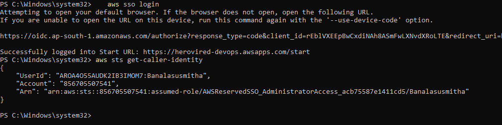

The caller identity shows the account and the `AdministratorAccess` role that Terraform uses.

---

## 3. Source code

Each service is a small Node.js 22 HTTP server with **no npm dependencies**, so the images build quickly and the same way every time. Every backend returns a sample response on `/`, for example:

```json
{"service":"user-service","message":"User Service Running","port":3001}
```

On every page load, the frontend calls each backend's `/` endpoint and shows whether it is running. `/api/<name>` returns that backend's data.

Dockerfile (the same for every service, only the port changes):

```dockerfile
FROM node:22-alpine
WORKDIR /app
COPY package.json server.js ./
ENV PORT=3001
EXPOSE 3001
CMD ["node", "server.js"]
```

---

## 4. Building the images

```powershell
docker build --platform linux/amd64 -t susmitha/user-service:v1 ./user-service
```

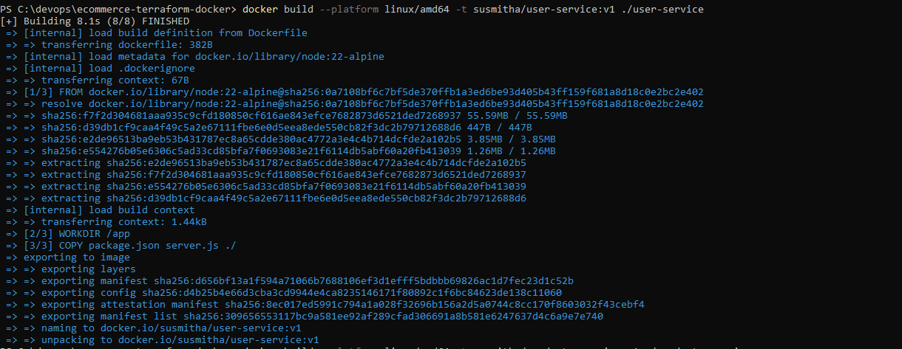

The first build downloads the `node:22-alpine` base image.

```powershell
docker build --platform linux/amd64 -t susmitha/products-service:v1 ./products-service
```

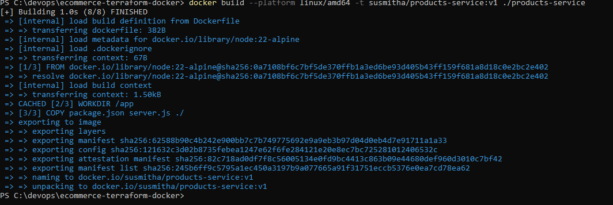

Later builds reuse the base layers from the cache (`CACHED`) and finish in about a second.

```powershell
docker build --platform linux/amd64 -t susmitha/orders-service:v1 ./orders-service
```

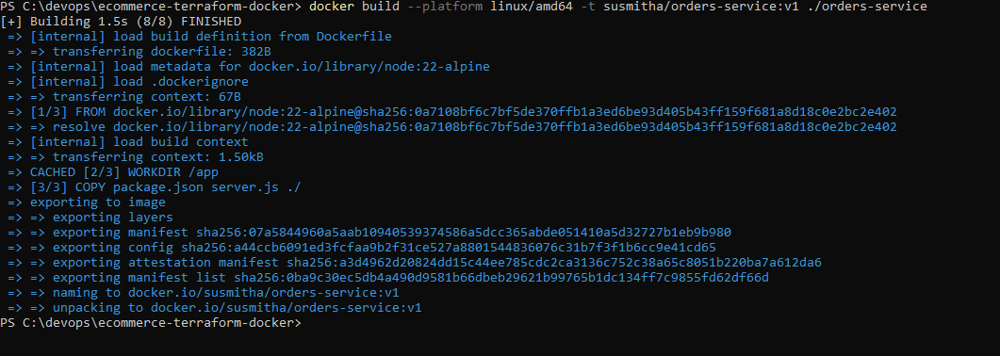

```powershell
docker build --platform linux/amd64 -t susmitha/cart-service:v1 ./cart-service
```

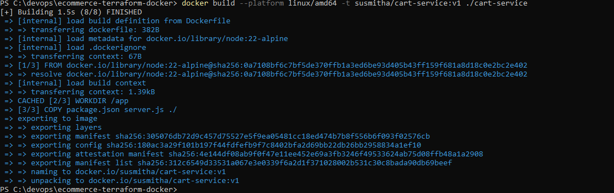

```powershell
docker build --platform linux/amd64 -t susmitha/frontend:v1 ./frontend
```

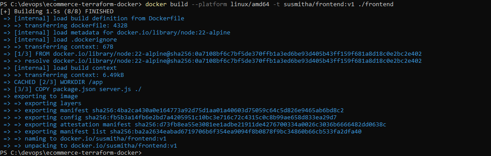

All five images are present locally:

```powershell
docker images --filter "reference=susmitha/*"
```

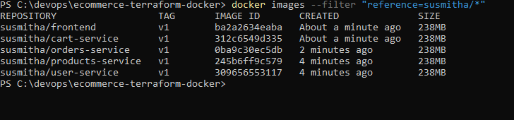

Note the IMAGE IDs; they appear again in section 6.

---

## 5. Local testing

```powershell
docker network create ecommerce-net
```

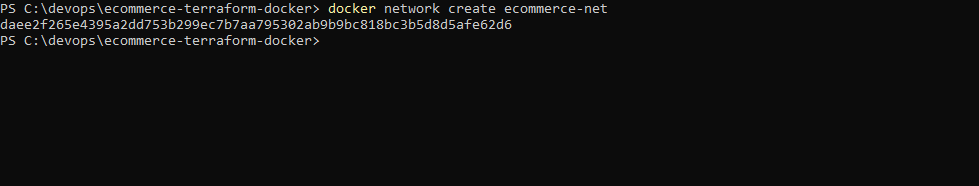

```powershell
docker run -d --name user-service --network ecommerce-net -p 3001:3001 susmitha/user-service:v1
docker run -d --name products-service --network ecommerce-net -p 3002:3002 susmitha/products-service:v1
docker run -d --name orders-service --network ecommerce-net -p 3003:3003 susmitha/orders-service:v1
docker run -d --name cart-service --network ecommerce-net -p 3004:3004 susmitha/cart-service:v1
docker run -d --name frontend --network ecommerce-net -p 8080:3000 susmitha/frontend:v1
```

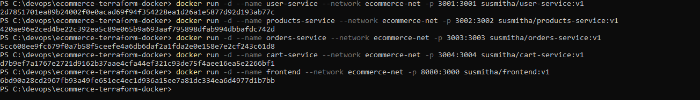

```powershell
docker ps
```

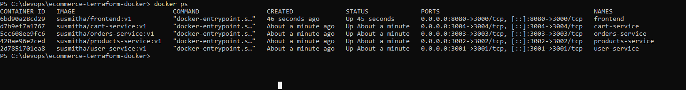

All five containers are `Up` with the expected port mappings. Locally the frontend uses port 8080, to avoid clashing with anything already on port 80.

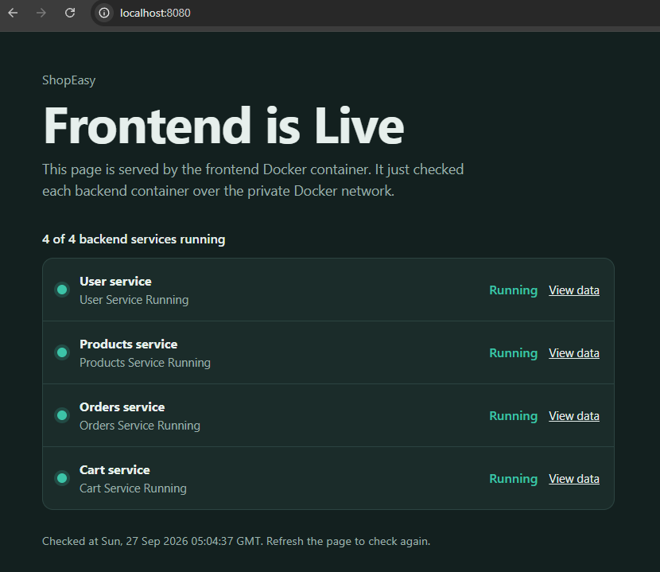

This is the key local result. `http://localhost:8080` shows **Frontend is Live** and **4 of 4 backend services running**. The status comes from live calls the frontend made to each backend container by name, which proves service-to-service communication over the Docker network.

```powershell
docker rm -f frontend user-service products-service orders-service cart-service
```

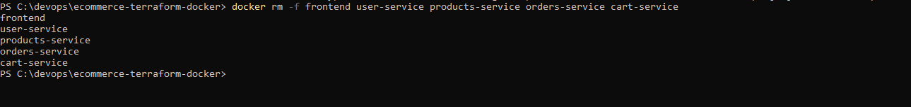

The test containers are removed; the images stay for the push.

---

## 6. Pushing to Docker Hub

### 6.1 Why the image names changed from `susmitha/` to `sunilstark007/`

Docker Hub only accepts an image whose name starts with the namespace of the **logged-in account**. The images were built as `susmitha/<service>:v1`, but the Docker Hub account used for this project is **`sunilstark007`**, so pushing `susmitha/...` would fail with `denied: requested access to the resource is denied`.

Rebuilding is not needed. `docker tag` adds a second name to the **same** image, so the IMAGE IDs before and after are identical (for example `ba2a2634eaba` for the frontend). From here on, every reference uses `sunilstark007`, including `dockerhub_username` in `terraform.tfvars`.

### 6.2 Login, tag and push

```powershell
docker login -u sunilstark007
```

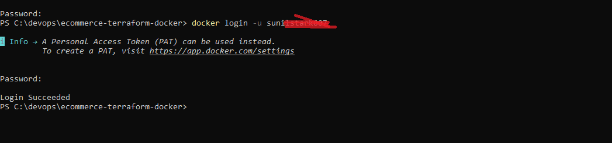

The login uses a Docker Hub personal access token as the password.

```powershell
docker tag susmitha/user-service:v1 sunilstark007/user-service:v1
docker push sunilstark007/user-service:v1
# same for products-service, orders-service, cart-service and frontend
```

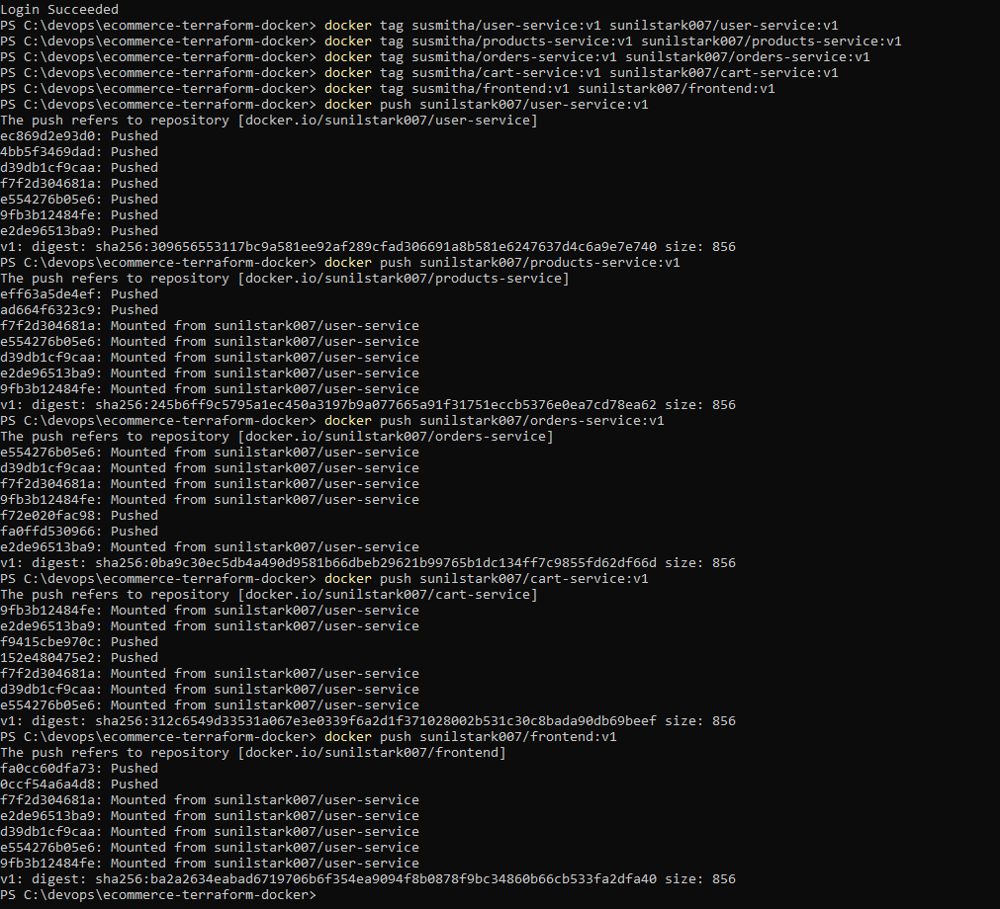

Only the first push uploads the shared Node.js base layers. The later pushes show `Mounted from sunilstark007/user-service` because Docker Hub reuses identical layers.

```powershell
docker images --filter "reference=sunilstark007/*"
```

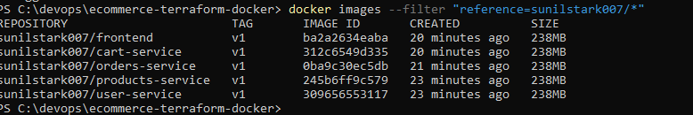

The IMAGE IDs match section 4, which confirms the images were renamed, not rebuilt.

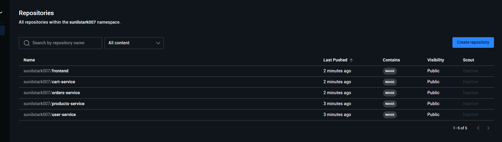

All five repositories are **Public**, so the EC2 instance can pull them without credentials.

---

## 7. Infrastructure with Terraform

### 7.1 Configuration

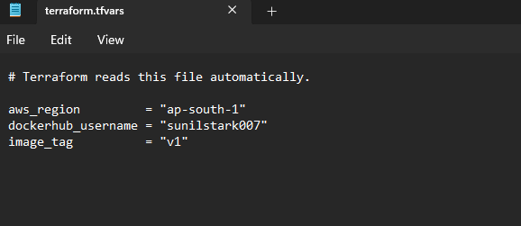

`terraform.tfvars` holds the only values that change between deployments: the region, the Docker Hub username and the image tag.

The heart of `user_data.sh.tpl`. Terraform's `templatefile()` fills in `sunilstark007` and `v1`:

```bash
apt-get update -y && apt-get install -y docker.io
systemctl enable --now docker
for svc in user-service products-service orders-service cart-service frontend; do
  docker pull "$DOCKERHUB_USER/$svc:$TAG"
done
docker network create ecommerce-net
docker run -d --name user-service --network ecommerce-net --restart unless-stopped \
  -p 3001:3001 "$DOCKERHUB_USER/user-service:$TAG"
# products-service :3002, orders-service :3003, cart-service :3004 in the same way
docker run -d --name frontend --network ecommerce-net --restart unless-stopped \
  -p 80:3000 -e USER_SERVICE_URL=http://user-service:3001 ... "$DOCKERHUB_USER/frontend:$TAG"
```

### 7.2 Init, validate and plan

```powershell
cd terraform
ssh-keygen -t rsa -b 4096 -f ecommerce-key
terraform init
```

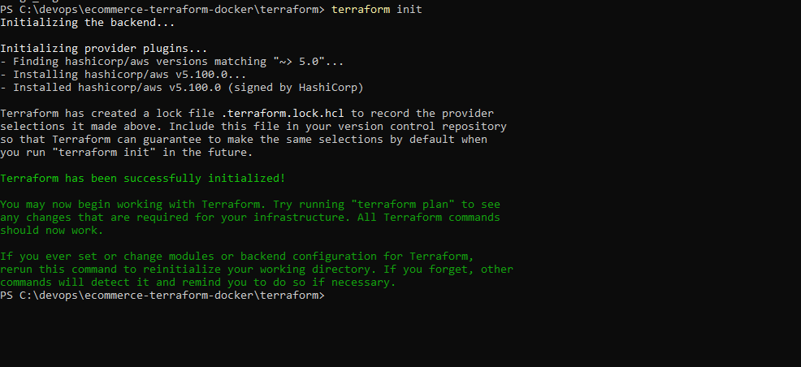

Installs the `hashicorp/aws` provider v5.100.0 and creates `.terraform.lock.hcl`.

```powershell
terraform validate
terraform plan
```

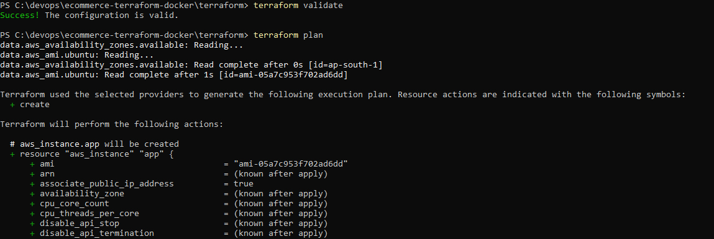

The configuration is valid. The plan resolves the availability zones and the latest Ubuntu 22.04 AMI (`ami-05a7c953f702ad6dd`) before listing the resources.

### 7.3 Apply

```powershell
terraform apply
```

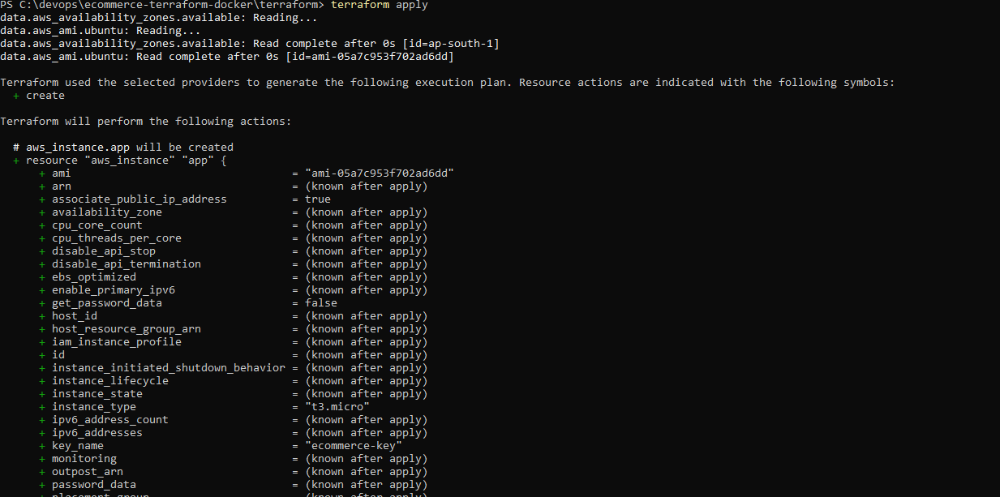

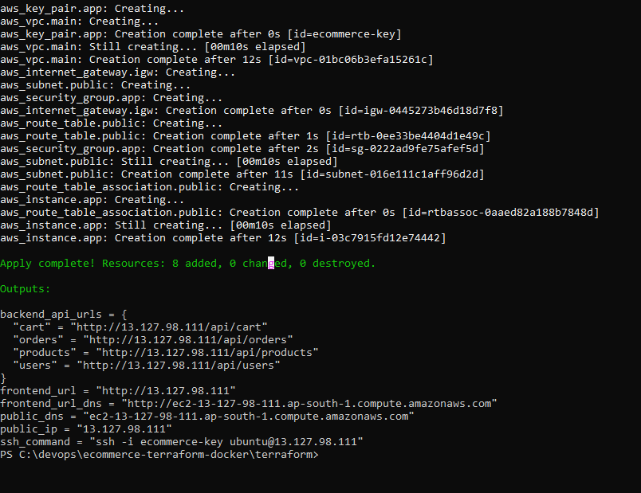

`Apply complete! Resources: 8 added`. The outputs print everything needed to reach the application:

| Output | Value |
| --- | --- |
| `public_ip` | `13.127.98.111` |
| `public_dns` | `ec2-13-127-98-111.ap-south-1.compute.amazonaws.com` |
| `frontend_url` | `http://13.127.98.111` |
| `backend_api_urls` | `http://13.127.98.111/api/{users,products,orders,cart}` |
| `ssh_command` | `ssh -i ecommerce-key ubuntu@13.127.98.111` |

---

## 8. Verification

### 8.1 Frontend is publicly accessible

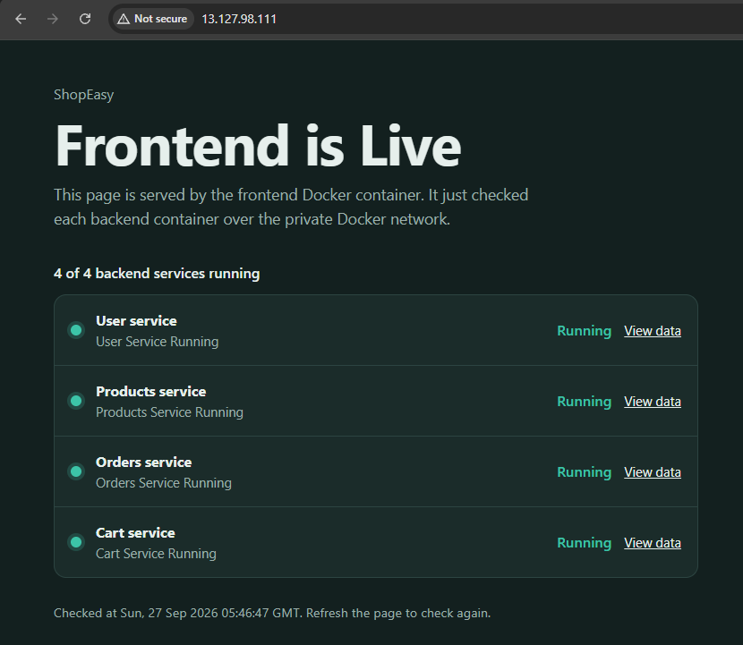

This is the key result. The page is served from the EC2 instance on port 80, and all four backends report **Running**. Each status line comes from a live call from the frontend container to that backend container over `ecommerce-net`.

### 8.2 Backend data through the frontend

```powershell
curl.exe http://13.127.98.111/api/products
```

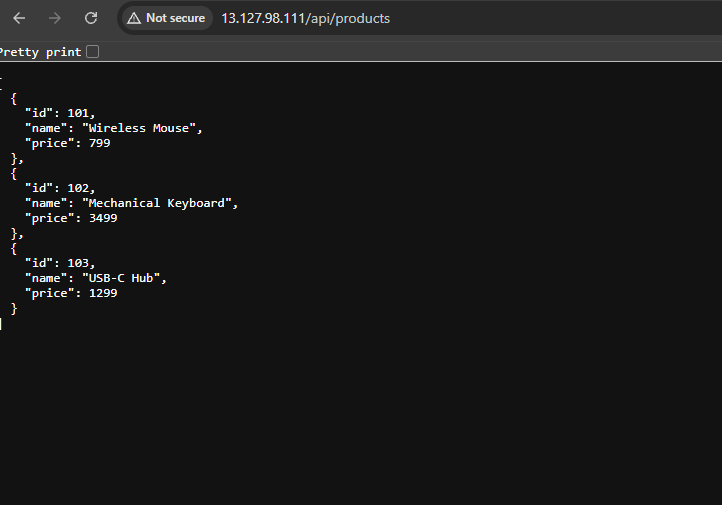

The product data lives in the **products-service** container, not the frontend. Receiving it proves the frontend resolved `products-service` by name and proxied the request.

### 8.3 Containers on the instance

```powershell
ssh -i ecommerce-key ubuntu@13.127.98.111
```

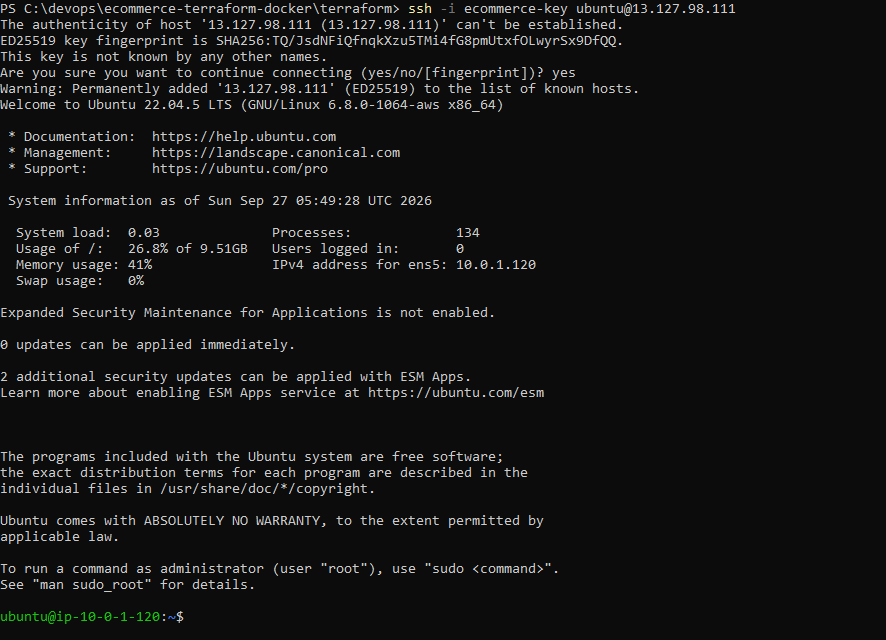

Ubuntu 22.04.5 LTS, private IP `10.0.1.120` inside the public subnet.

```bash
sudo docker ps
```

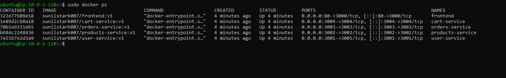

All five containers were pulled from `sunilstark007` and are `Up`. The frontend is published on `80->3000` and the backends on `3001-3004`. This shows user-data pulled the images and ran them on the correct ports.

### 8.4 Backend logs and responses

```bash
sudo docker logs user-service
curl localhost:3001
curl localhost:3002
curl localhost:3003
curl localhost:3004
```

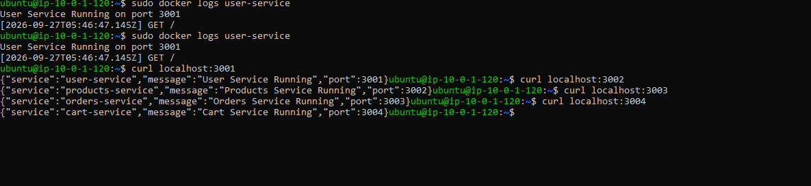

The log shows `User Service Running on port 3001`, and every backend returns its sample response.

### 8.5 User-data log

```bash
sudo tail -n 20 /var/log/user-data.log
```

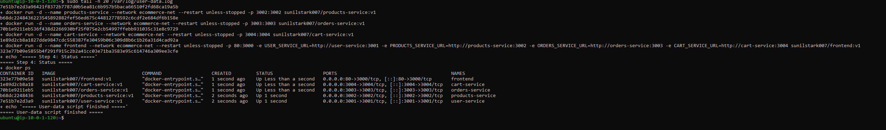

The boot script completed: Docker was installed, the five images were pulled, the containers started, and the log ends with `User-data script finished`.

### 8.6 AWS console

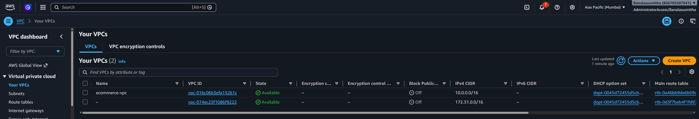

`ecommerce-vpc` (`10.0.0.0/16`) in Asia Pacific (Mumbai). The unnamed `172.31.0.0/16` VPC is the account default and is not used.

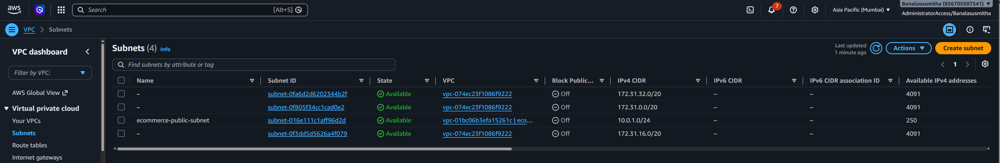

`ecommerce-public-subnet` (`10.0.1.0/24`) belongs to `ecommerce-vpc`.

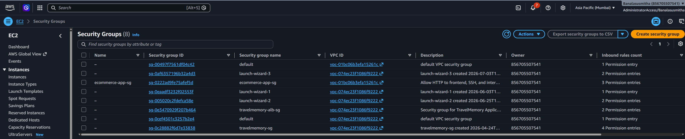

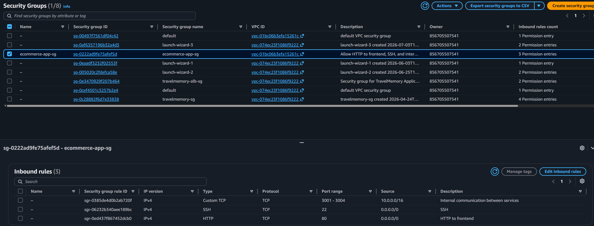

`ecommerce-app-sg` has exactly the three intended rules: `80` from `0.0.0.0/0`, `3001-3004` from `10.0.0.0/16` and `22` for SSH. The other groups in the list come from earlier work in this account.

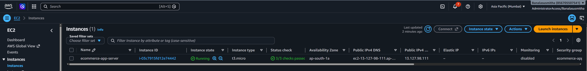

`ecommerce-app-server` is `Running` as `t3.micro` in `ap-south-1a`, with 3/3 status checks passed.

---

## 9. Requirements coverage

| Requirement | Where it is met |
| --- | --- |
| Dockerfile for each of the 5 services, with a port and a sample response | Sections 3, 4; responses in 5 and 8.4 |
| Build and test the images locally | Sections 4, 5 |
| Tag and push the images to Docker Hub | Section 6 |
| VPC with at least one public subnet | `network.tf`; section 8.6 |
| 1 or more EC2 instances | `ec2.tf`; sections 7.3, 8.6 |
| Security group: HTTP 80 to the frontend, 3001-3004 internal | `security_group.tf`; section 8.6 |
| User-data installs Docker, pulls all 5 images and runs them on the proper ports | `user_data.sh.tpl`; sections 8.3, 8.5 |
| Frontend publicly accessible ("Frontend is Live") | Section 8.1 |
| Backend containers verified running | Sections 8.2-8.4 |
| Terraform output prints the public IP / DNS | Section 7.3 |
| Ubuntu AMI, public Docker Hub images, reproducible with `terraform apply` | Sections 1, 6.2, 7 |

---

## 10. Troubleshooting

| Symptom | Likely cause | Fix |
| --- | --- | --- |
| `error during connect ... dockerDesktopLinuxEngine` | Docker Desktop engine not started | Open Docker Desktop and wait for *Engine running* |
| `terraform` not recognized after install | PATH only refreshes in new terminals | Close and reopen PowerShell |
| `Token has expired and refresh failed` | AWS SSO session expired | `aws sso login` |
| `denied: requested access to the resource is denied` on push | Image namespace does not match the Docker Hub account | `docker tag` to `sunilstark007/...` (section 6.1) |
| `git push`: `Repository not found` | Repository not created yet, or wrong GitHub account | Create the repo under `banalasusmitha`, then push again |
| Browser shows *connection refused* right after apply | User-data still installing Docker and pulling images | Wait 3-4 minutes and refresh |
| A service shows **Down** on the homepage | Container not running | `sudo docker ps -a` and `sudo docker logs <name>` |
| `exec format error` in container logs | Image built for ARM | Rebuild with `--platform linux/amd64` |
| `pull access denied` in `/var/log/user-data.log` | Wrong username or tag in `terraform.tfvars`, or a private repo | Fix `terraform.tfvars` or make the repo public, then re-apply |
| `curl` behaves oddly in PowerShell | `curl` is an alias for `Invoke-WebRequest` | Use `curl.exe` |

---

## 11. Cleanup

```powershell
cd terraform
terraform destroy
```

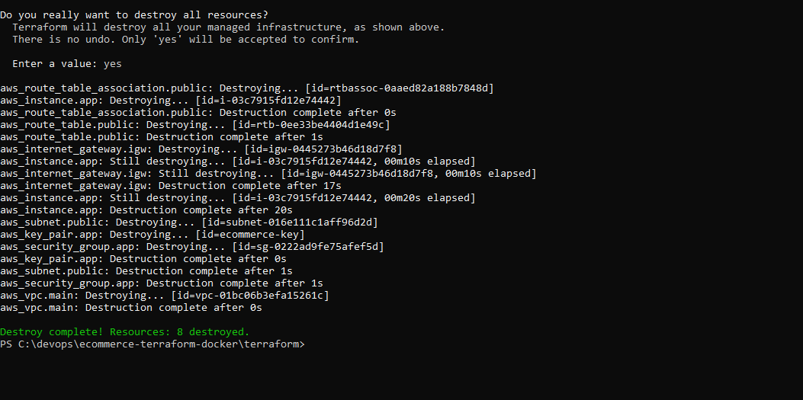

All 8 resources are removed so nothing keeps running in the account. The whole environment can be recreated at any time with `terraform apply`.

---

## 12. Repository layout

```
ecommerce-terraform-docker/
├── frontend/
│   ├── Dockerfile
│   ├── server.js
│   └── package.json
├── user-service/            # same three files
├── products-service/        # same three files
├── orders-service/          # same three files
├── cart-service/            # same three files
├── terraform/
│   ├── provider.tf          # Terraform + AWS provider
│   ├── variables.tf         # input variables
│   ├── terraform.tfvars     # ap-south-1, sunilstark007, v1
│   ├── network.tf           # VPC, IGW, subnet, route table
│   ├── security_group.tf    # firewall rules
│   ├── ec2.tf               # AMI lookup, key pair, EC2 + user-data
│   ├── user_data.sh.tpl     # install Docker, pull and run the 5 images
│   ├── outputs.tf           # public IP, DNS, URLs, SSH command
│   └── .terraform.lock.hcl  # provider version lock
├── docs/
│   ├── architecture.drawio  # editable draw.io diagram
│   ├── architecture.png
│   └── Skill_Test_3_Banala_Susmitha.docx
├── screenshots/             # 02-36, one per step
├── build-and-push.sh        # optional helper
├── .gitignore               # excludes the private key, .terraform/ and state
└── README.md
```
